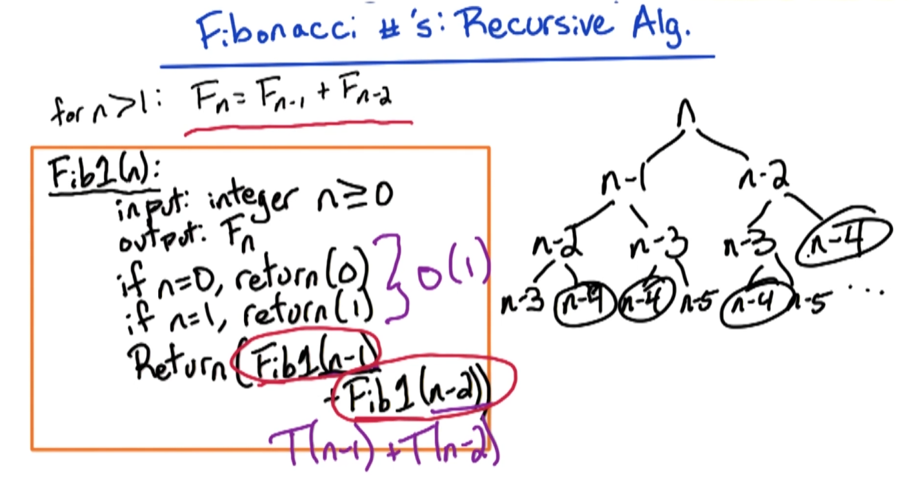
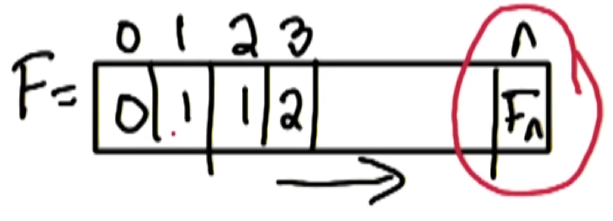
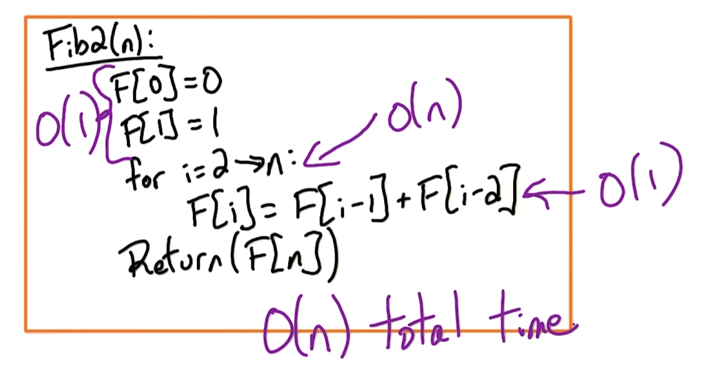
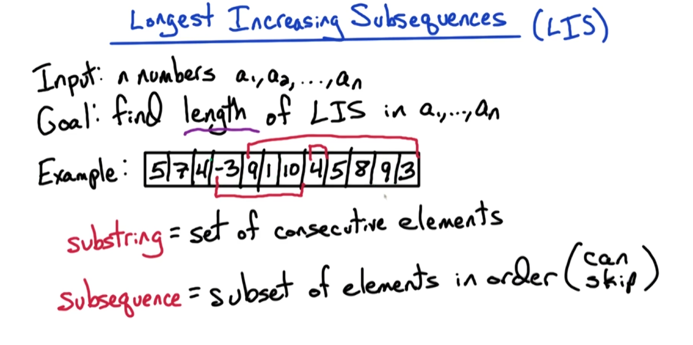
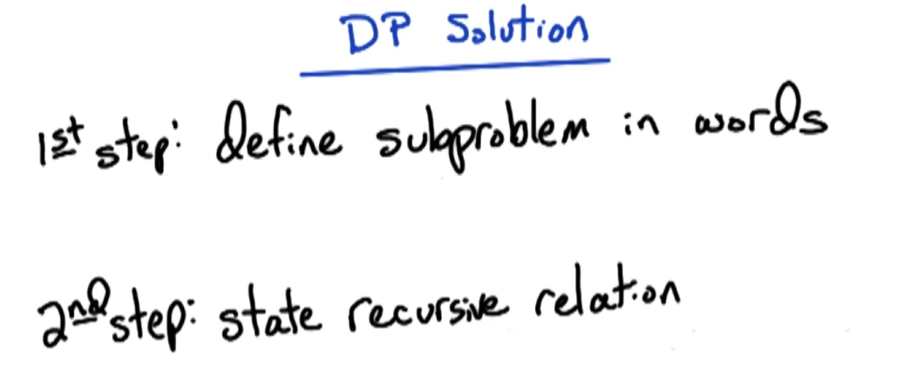
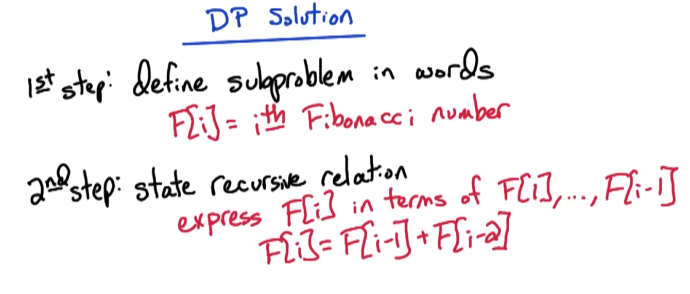
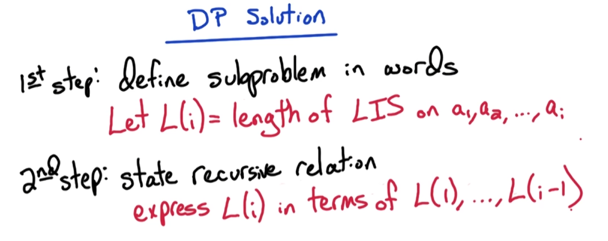
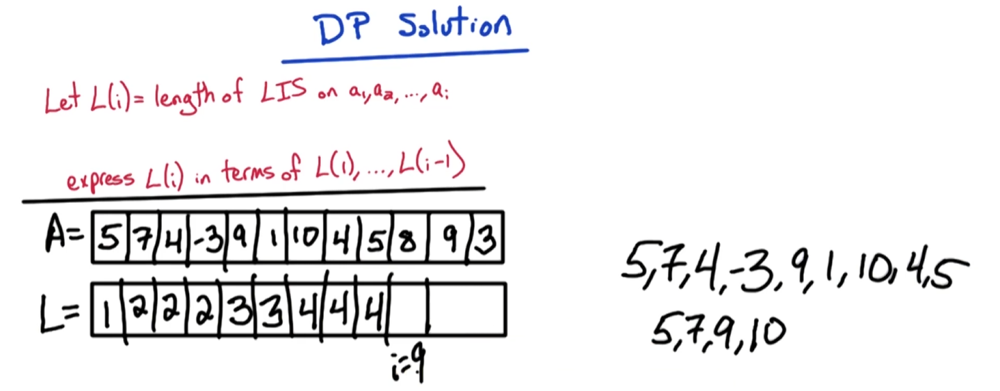
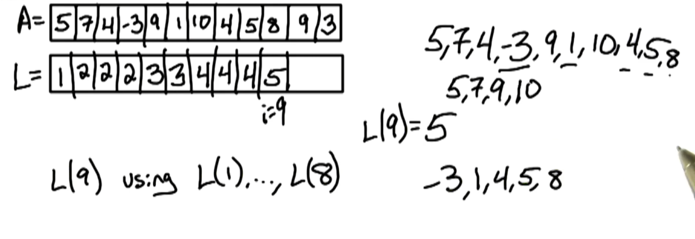
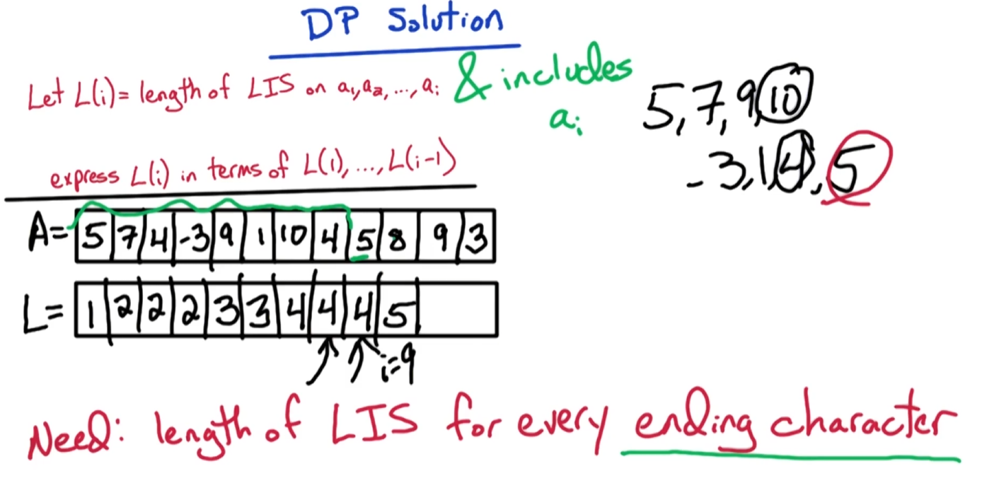

# DP1 FIB LIS LCS

## 1 Dynamic Programming Overview

Our first topic is dynamic programming. This is one of my favorite topics to teach because it is extremely useful. Students often have some trouble with it initially, but with enough practice it will sink in and actually, they will seem quite easy once you get the hang of it. I'll do my best to show you how I solve dynamic programming problems. And, from there the key to really mastering dynamic programming is to do lots and lots of practice problems. The homework is just a start. Do additional problems from the textbook, and from other algorithms textbooks, and from other courses you can find on the web. 

We'll start with the toy example, computing Fibonacci numbers, to illustrate the basic idea of dynamic programming. Then, we'll dive into a variety of example problems to get a feel for the different styles of DP algorithms;- Longest increasing subs sequence (LIS), longest common subsequence (LCS) the classic Knapsack Problem, chain matrix multiplication and finally, we'll look at a few shortest path algorithms using DP.

## 2 Fibonacci Numbers

Given an integer n, we're going to look at an algorithm for generating the n Fibonacci number. This will be a very simple algorithm, but it will illustrate the idea of dynamic programming and then, we'll look at dynamic programming in general; the techniques for designing a dynamic programming algorithm and we'll look at some more sophisticated examples. Recall the Fibonacci numbers are the following sequence:
 
$$0, 1, 1, 2, 3, 5, 8,13, 21, 34, \text{ and so on}$$
 
There's a simple recursive formula that defines the Fibonacci numbers. 
$$
F_0 = 0\\
F_1 = 1 \\
F_n = F_{n-1} + F_{n-2}, \text{ for } n > 1.\\
\text{Input: integer } n \geq0\\
\text{Output: $n$-th Fibonacci number } 
$$

The first two numbers in the sequence are zero and one, and then the n-th Fibonacci number is the sum of the previous two Fibonacci numbers. We're going to take as input and non-negative integer n and our goal is to output the nth Fibonacci number. 

We want an efficient algorithm and therefore we're aiming for a running time which is polynomial in n. Now, the Fibonacci numbers are defined by this simple recursive formula $F_n = F_{n-1} + F_{n-2}$. Therefore, we might think a recursive algorithm is a natural algorithm for this problem. Let's look at that natural algorithm, that natural recursive algorithm and when then we'll analyze it.

## 3 FIB1 Recursive Algorithm

Let's look at the natural recursive algorithm for computing the Nth Fibonacci number. Recall from the previous slide, the recursive formula for the Nth Fibonacci number is the sum of the previous two Fibonacci numbers. Let's detail the recursive algorithm for computing the Nth Fibonacci number. We'll call the algorithm Fib1, a little bit foreshadowing. 

$$
\text{ for } n > 1: F_n = F_{n-1} + F_{n-2}
$$

```
Fib1(n):
    input: integer n>=0
    output: F_n
    if n=0, return(0)
    if n=1, return(1)
    Return( Fib1(n-1) + Fib1(n-2))
```


This will be our first attempt then we'll have a second successful attempt for efficiently computing the Fibonacci numbers. Recall the input to our algorithm is a non-negative integer n, and the output is the Nth Fibonacci number or more precisely actually the n plus first Fibonacci number if you're keeping track of the indices. First, we'll deal with the base cases. The first two Fibonacci numbers are zero and one. In general, we'll utilize the recursive definition of the Fibonacci numbers. We will recursively compute the n minus first, and n minus second Fibonacci number. And we'll return the sum of those two. This completes the definition of our algorithm. 

Now, let's take a look at the running time of our algorithm. To analyze the running time of our algorithm, let's create a function T of n which denotes the number of steps of our algorithm and an input of size n.
$$
\text{Let $T(n)$ = \# steps for Fib1(n)}
$$

We have two basic cases first: `if n=0, return(0)` and `if n=1, return(1)` . Those each take $O(1)$ time.


And then, we have a two recursive calls, one of size n minus one, and one of size n minus two. Those take time $T(n-1) + T(n-2)$. Putting it all together, we have the following formula.

$$
T(n) \leq O(1) + T(n-1) + T(n-2)
$$

Our running time on the input of size n is $O(1)$ for the two base cases and then, T of n minus one in order to compute the n minus first Fibonacci number, and T of n minus two to compute the n minus second Fibonacci number. 

Now, this formula may look a little bit familiar. Notice, it reminds us of the Fibonacci numbers. In Fibonacci numbers, the n minus Nth Fibonacci number is the sum of the previous two. This is the sum of the previous two plus an extra term. *So, it's at least as large as the Nth Fibonacci number.* Therefore, our running time on input of size n is at least the Nth Fibonacci number. 

Now, unfortunately Fibonacci numbers grow exponentially in $n$. More precisely, they grow exponentially in this constant $\phi$. What is $\phi$? Well, $\phi$ is this constant defined as one plus square-root five over two which is roughly 1.618. But phi is a magical constant. It's known as the golden ratio. The golden ratio has many applications. 

For example, if you're designing a building such as the Parthenon or if you want just a cool fact to show your kids, then look up the golden rectangle. But for us, the punchline is that the Fibonacci numbers grow exponentially in n. And the running time to compute the Nth Fibonacci number using a recursive algorithm is at least the Nth Fibonacci number.
**So, our running time is exponential in n.** 

So this is a terrible algorithm for computing the Nth Fibonacci number. Let's take a look at exactly why our running time is so terrible and then, we'll get an idea for a more efficient algorithm.

## 4 FIB1 Exponential Running Time

Let's take a look at the recursive nature of our algorithm. At the top level of the recursion, we're computing the nth Fibonacci number. Then we have recursive subclause computing the n minus first and n minus second. And we recursively compute the n minus first Fibonacci number, in which our algorithm is going to recursively compute the n minus second and n minus third Fibonacci number. And for the n minus second, it recursively computes the n minus third and n minus fourth Fibonacci numbers and so on.



Notice that the n minus fourth Fibonacci numbers can be compute in many times. Similarly, when we get down to small Fibonacci numbers, we're gonna be recomputed them many times exponential number of times. That causes the inefficiency of our algorithm because we're recomputing the solution to the small sub-problems many times. To get around that, we're gonna flip the algorithm on its head. We're gonna compute the small sub-problems first, and then work our way to the larger sub-problems. 

In particular, we're gonna make an array F, we're gonna call it, to denote the Fibonacci numbers, and $F[i]$ is gonna be the i-th Fibonacci number. We're gonna start at index zero, and we're gonna record the first Fibonacci number, and the second Fibonacci number, and then we're gonna use a recursive formula to compute the third Fibonacci number and so on. We're gonna increase our index using the recursive formula. Finally, we'll get the n Fibonacci number. This is the idea of our algorithm. We start with the small indices, compute the small Fibonacci numbers, and then, we'll work our way up to compute the larger Fibonacci numbers using our recursive formula $F_n = F_{n-1} + F_{n-2}$. 



This is our dynamic programming algorithm. So let's define it more precisely, so we are all clear.

## 5 FIB2 DP Algorithm

Now, let's detail our dynamic programming algorithm for computing the nth Fibonacci number. Here's our second attempt at an algorithm for computing the nth Fibonacci number.
```
Fib2(n):
    F[0] = 0
    F[1] = 1
    for i = 2 -> n:
        F[i] = F[i-1] + F[i-2]
    Return(F[n])
```

Recall, we're going to create an order array F which is going to store the Fibonacci numbers and we're going to start at the small indices namely. At the first two indices, we store the two base cases, zero and one, which are the first two Fibonacci numbers in the sequence. Then we have a for loop which goes from two up to n which is our goal. And using the recursive formula, the ith Fibonacci number is the sum of the previous two which are already stored in our array. Finally, we return the nth Fibonacci number which is stored in the last index in our array. This completes our algorithm. Notice the key thing is that our algorithm has no recursion in it. We have a recursive formula which defines the Fibonacci numbers but our algorithm has no recursion in it. 

Finally, let's analyze the running time of our algorithm. Once again, the base cases take order one time each. Then we have a for loop of size order n. The one step of the for loop takes order one time. Therefore, the total time of the for loop is order n time and the total run time of our algorithm is order n time. This completes our algorithm and gives us a glimpse of a dynamic programming algorithm.


## 6 FIB2 DP Recap

Before moving on to a more sophisticated example, let's recap a few key issues. I want to stress one important point about Dynamic Programming algorithms. Our algorithm had no recursion inside of it. We used the recursive nature of the problem to design our Dynamic Programming Algorithm, **but the algorithm itself has no recursion inside of it.** 

Now, there is an alternative approach to Dynamic Programming. In this approach, you use a hash table or some other similar structure to keep track of which sub-problems that have already been solved, so that you don't recompute those problems. Now, we're not going to use this at all in our course. This approach is called **memoization**. Try to say that five times, I can't and therefore we're not going to use it in this class. But actually, the real reason why we're not using it, is because the goal of this unit is to learn dynamic programming.

Therefore, to avoid any confusion we're going to say no recursion in our algorithms. Dynamic programming has several advantages over memoization or similar techniques. Some might say the algorithms themselves are more beautiful. Certainly, they're faster because they have less overhead from avoiding recursion. And finally, it's much simpler to analyze the running time of Dynamic Programming algorithms.

Dynamic programming is widely used. At first, students often find it challenging, but what we find is that with enough practice the dynamic programming algorithms start to seem similar to each other. At that point it will click and hopefully it'll seem easy to design a dynamic programming after that. 

To get to that point, what do you need to do? Practice, practice, practice. Do a lot of practice problems and then it will click and you'll find dynamic programming easy. We're going to do some in class, you're going to do something during the homework and then do a lot on your own. There's a lot of practice dynamic programming problems out there in the textbook and other online resources that you can find. You do enough practice, you ace the topic.

## 7 Longest Increasing Subseq

Let's look now at a more sophisticated example of dynamic programming. The problem we're going to consider is the longest increasing subsequence problem. And for simplicity, we'll call it LIS. 

The input to the problem are n numbers which we'll denote as, $a_1, a_2,..., a_n$. Our goal is to compute the length of the longest increasing subsequence in the N numbers of the input. One important note, we're only trying to find the length of the longest increasing subsequence. We're not trying to find the subsequence itself. But if we can find the length, then we're going to get to the heart of the problem and then it will be easy to transform that into an algorithm to output an actual subsequence of longest length. 



Let's take a look at a specific example to help illustrate the terminology in this problem. Here's an example where n=12.

$$
5, 7, 4, -3, 9, 1, 10, 4, 5, 8, 9, 3
$$

Before defining subsequence, let's recall the definition of the more common term substring. A substring is a string that occurs inside the larger string. So it's a set of consecutive elements. For instance, here's one substring `-3, 9, 1, 10`. Another substring is for itself. And another substring is `9, 1, 10, 4, 5, 8, 9, 3`. These are all substrings. How many substrings are there possible? We can specify a substring by the start index and the ending index. Therefore, there is at most order $n^2$ substrings. 

Now, our problem is not defined for substrings, it's defined for subsequences. A subsequence is a string you can obtain by deleting elements of the larger string. So it's a subset of elements in order but we can skip elements. It doesn't have to be consecutive elements. Let's look at some examples subsequences. For instance, `4, -3, 1, 9` is a subsequence. Another subsequence is one itself. Another subsequence is `5, 7, 3`. Now, we're trying to find a subsequence which is increasing. That means that each number is strictly larger than the previous. In this case, it's not increasing because of 3 is smaller than 7 but an increasing subsequence for instance, is `4, 9,10`. 

Another subsequence is `4, 4, 8, 9`. But that is not an increasing subsequence. That's a non-decreasing subsequence, and we don't allow that in our example. Our goal is to find the longest increasing subsequence in the input array. For this example, what is the longest increasing subsequence? The longest increasing subsequence in this example is minus `3, 1, 4, 5, 8, 9` which is of length 6. So, the output of our algorithm on this instance is 6. Now, let's try to design a dynamic programming algorithm for this longest increasing subsequence.

## 8 LIS Subproblem Attempt 1

Now let's look at the recipe for designing a dynamic programming algorithm. 



The first step, is to define the sub-problem in words. To see what I mean by this, let's look back at the simple example of Fibonacci numbers. 



In this example, our sub-problem definition was $F[i]$ is the i-th Fibonacci number. The second step in our recipe, is to state a recursive relation. We want to express the solution to the I sub-problem in terms of smaller sub-problems. So for the instance of Fibonacci numbers, we want to express $F[i]$ in terms of $F[1]$ through $F[i-1]$. Because if you recall our dynamic programming algorithm for computing the Fibonacci numbers, we computed $F[1] ... F[i-1]$, so those will be stored in our table, and then we can use those to compute $F[i]$. 

Now for the case of the Fibonacci numbers, it was straightforward to express $F[i]$ in terms of smaller sub-problems. Namely $F[i]$ is the sum of the previous two Fibonacci numbers.

Now, let's figure out how to follow this recipe for the longest increasing sub-sequence problem. 



Now, let's follow the first step in our recipe. We want to define the sub problem in words. Our first attempt is always going to be, to use the identical problem on a prefix of the input. In this case, that means we're going to look at the longest increasing sub-sequence on the first I elements of the input array. Therefore, we're going to make a new function L, which is the length of the longest increasing sub-sequence on the first i elements of the input. Now, we want to figure out how to express $L(i)$ in terms of $L(1)$ through $L(i-1)$ smaller subproblems. To do this, let's take a look back at our earlier example, and see if we can gain some intuition.

## 9 LIS Recurrence Attempt 1

Recall, our subproblem definition is $L(i)$, is the length of the longest increasing subsequence on the first i elements of the input, all right? And our goal is to express $L(i)$ in terms of the solution to smaller subproblems. 

So, now, let's recall our earlier example. Here is our earlier example which had n=12.
$$
A = 5, 7, 4, -3, 9, 1, 10, 4, 5, 8, 9, 3
$$



Now, let's look at L on this example. To start with, for $L(1)$, we're looking at the longest increasing subsequence on the one element array. That's length one or five itself. Then, for $L(2)$  we're looking at the two element array `5, 7` the longest increasing subsequence is `5, 7` itself, which is length 2. And for `5, 7, 4`; then `5, 7` is still the longest and we add on `-3`, but still length 2 is the longest, for 9, we can appended on to the longest solution, and we get the length 3. With 1 added, length stays 3. When we add on 10, we can append 10 on to the longest solution and we get length=4. 


Now let's pay attention to the case i=9. What is L of i=9? Well, we cannot append on A on to the end of this current longest solution but in fact, there's a different solution. `-3,1,4,5,` for which we can append A on to the end and we get a solution of length 5. 

So, the problem is, how can we compute L(9) using L(1) through L(8)? How do we know whether we can append 8 on to the end of the current solution or not? We're not maintaining the current solution but even if we maintain the current solution, how do we know that we can append 8 on to the end of it? For this solution we couldn't maintain it. We couldn't append it on to the end. But for this solution we could append 8 on to the end of it. 

So, suppose we kept track of the current solution or actually, what do we need to know? We need to know the ending character of the current solution and what's the key fact? We want to know the longest increasing subsequence with the minimum ending character. 

So, we want to know the smallest ending character, because the smallest ending character gives us the most possibilities for appending on a new character on to the end. So in this case, in order to compute L(9) using L(1) through L(8), we need to keep track of the longest increasing subsequence solution with the minimum ending character. And in this case, it's 5 and then we realize we can append 8 on to the end of it and we can increase those solution length from 4 to 5. 

Let's go back to i=8 and we'll start to see the complication in this solution. Previously, our solution was `5, 7, 9, 10` but actually with our new formulation what we want to maintain is, `-3, 1, 4, 5` because this is also of length 4 and it ends in a smaller character. 

For now let's go back to i=7. For i=7, the longest increasing subsequence is 5,7,9,10. But, no. When i=8, we need to have this sequence minus 3 1,4. Now this is only length 3. So it's a suboptimal solution but we need to maintain it in order to realize that in the next step that we can append 5 on to the end of it and then we obtain a length 4 solution for i=8. 

So, how do we maintain this suboptimal solution? The key is, that for every possible ending character, we want to maintain the length of the longest increasing solution with that ending character.** We need to know the length of the longest increasing subsequence for every possible ending character.** If we know that for every possible ending character, then when we get a new character, in this case five, we can try all possible ending characters and we can try to add on five and see whether it is allowed to add on five on to the end of it. 

Now, how many possible ending characters are there? What are the possible ending characters? Well, the ending characters must be an earlier element in the input array. So in this case it is `5,7,4, -3` up to 4. Those are the possible ending characters. So they're not limitless. There's a finite small number. Actually, $i-1$ possible ending characters. So, this actually gives us an idea for how to modify our subproblem formulation. We want to know the length of the longest increasing subsequence for every possible ending character. We just noticed that the possible ending characters are the earlier elements in the array. 

Therefore, we want to maintain the length of the longest increasing subsequence for each element of the array. This gives us an idea for the new subproblem formulation. We're going to modify the length of the longest increasing subsequence on $A_1$ through $A_i$ and includes $A_i$, okay? So this will give us the longest increasing subsequence, which ends at the i-th element of the array, in this case five. And then, we have that for L(1) through L(i-1) and then we can use that to decide what is the longest sequence ending at 8 because we can see which characters allow us to append 8 on to the end of it.



Let's go back and formulate this more precisely and then we'll see the recurrence.

## 10 LIS Subproblem Attempt 2

We now have a new subproblem formulation, let $L(i)$ denote the length of the longest increasing subsequence on the first i elements of the input array a_1 through a_i and which includes a_i itself. This is the extra restriction that we added into our subproblem formulation, okay? It requires that a_i is included in the subsequences that you consider. Now, it will be straightforward to express a recurrence, which formulates L of i in terms of L_1 through L_i minus one. Let's go back and look at our earlier example and now we'll see, the straightforward recurrence that arises. Here is our earlier example. And let's look at L for this new subproblem formulation. In this case, L of one is one because we're looking at the length of the longest increasing subsequence on an input of size one just five itself and it has to include five. Then for i=two with length two from the subsequent five, seven. Now, we start to see a difference when i=three. What is the length of the longest increasing subsequence in five, seven, four which includes four? That's just four itself. So that's length of one, okay? Recall in our earlier definition of L, it was length, it was three this entry. Once again, for i=four, L of four is one because of minus three. So i=five, now, the length is three from five, seven, nine. For i=six, the length is two from minus three one, for i is equals seven, the length is four from five, seven, nine, ten. Finally, let's look at the case i=10 which is the case which caused the problems in the earlier definition of L. Now, in this case, we want to see which subproblems allow us to append A on to the end of it. I notice a can be appended on to subsequences ending at five, seven, four minus three but nine, it cannot get appended on to, that won't be increasing. It cannot get appended on to 10 either. But the others allow it to be appended on to the end. So, we're going to take the longest of those and we're going to add plus one for adding eight on to the end of it. So whatever is the longest increasing subsequence ending at five, we can append eight on to the end of it. We don't have to know the subsequence itself. We just have to know, it's of length four and it ends at five and then we can append A on to the end. We obtain the sequence of length five, therefore, L of 10 is five. Now, this highlights the recurrence for the solution of L of i, in terms of smaller subproblems L_one through L minus one, i minus one

## 11 LIS Recurrence Attempt 2

Outlets formally state the recurrence for L of i in terms of smaller subproblems. L of i requires that ai is included in the subsequence. Therefore we get 1 for including element ai in it. And then we take the longest subsequence that we can append on to the beginning. So we're going to take the max over all earlier indices of the length of the subsequence ending at that character aj. Now that earlier subsequence allows us to append ai onto the end of it only if aj is strictly smaller than ai. So you only want to consider j's where aj is strictly smaller than ai. And then we can take that earlier subsequence ending at aj and append ai onto the end of it and we get L of j for that earlier subsequence plus 1 for ai. And of course, we need that j is earlier in the input array than ai. Just in case the mathematical notation is confusing for anybody let me re-express it with slightly different notation and re-explain what it's saying in words. So L of i, the length of the longest increasing subsequence on the first i elements, which includes ai. So we get one for that element ai and then we're taking, we have ai here. Then we're going to take the longest increasing subsequence that we can put at the beginning. It's going to end at some element aj. Okay. So we're going to try all possibilities for that j. Now, we need that index j is earlier in the input array. So we're going to try j's between i minus 1 and 1. And we only want to try j's where aj is strictly smaller than ai. So we're doing a max over j. J is the variable that we're varying. We're trying j's where it's between 1 and i minus 1 in such that aj is strictly smaller than ai and we're taking the value L of j. Finally, we have our sub-problem definition and we have our recursive relation that the sub-problems satisfy. Now to be straightforward to detail our dynamic programming algorithm. So let's give this pseudocode for a dynamic programming algorithm and then analyze its running time and then we'll have completed this problem.

## 12 LIS DP Algorithm

Now, let's date the pseudocode for the dynamic programming algorithm for the longest increasing subsequence problem. And I kept the recurrence from the previous slide about the L of i in terms of smaller subproblems as a sort of crib notes for ourselves. Here's a pseudocode for our dynamic programming algorithm for the LIS problem. The input is a1 through an. Our solutions are in one dimensional array L and we're going to fill the table L from bottom up. So we're going to start at index i equals 1 and go up to i equals n. So we're going to have a single for loop for i going from 1 to n. Now our subproblem formulation requires that ai is included in the solution for L of i plus one term. Therefore, we start by setting L of i equal to 1. And then we're going to do the max over j. So we're going to have another for loop which varies j from 1 to i minus 1. Now we need to check that aj is strictly smaller than ai. If aj is strictly smaller than ai, then we need to check if the solution we can obtain by appending ai onto the end of the solution ending at aj is longer than our current best solution. So if aj is strictly smaller than ai, and our current best solution L of i is strictly smaller than the new solution, we can obtain by appending ai onto the end of L of j. In this case we want to update our current best solution, which is now the solution that we obtained by appending ai onto the end of the solution that ends at aj. Now we've given an algorithm which defines our table L. But what is the solution that we're trying to output from this algorithm? For the case of Fibonacci numbers, it was the last entry in the table. In this case, the last entry of the table is the longest increasing subsequence ending at an. That's not necessarily the solution that we're trying to obtain. We're trying to find the longest increasing subsequence regardless of where it ends at. So what we need to do is try to look through L and find out maximum entry in the entire one dimensional array. So let's go ahead and do that. We'll make a variable max, which will maintain the index with the largest entry of the table. We'll start max at 1 and then we'll go through the entries at the table to see if we find a larger entry than the current max. This for loop simply finds the largest entry of the table and stores the index for that entry in the variable max. Finally, what do we return? We return the entry at index max. This completes the formulation of our dynamic programming algorithm. Now let's take a look at the running time of our algorithm.

## 14 LIS DP Running Time Solution

We have one for loop, which varies over order n elements, and we have another nested for loop, which varies over, at most, n elements. Within these two nested for loops, we have a if-then statement, which takes order one time. Therefore, the total time for these nested for loops is, order n-squared time. Finally, we have another for loop which finds a max entry in the table. This is one for loop, it's not nested, this is order n time. Therefore, the total run time of our algorithm is order n-squared time.

## 15 LIS Recap

This completes the formulation of our dynamic programming algorithm, and the analysis of its running time. But now, let's go back and take a look at some important aspects of our algorithm design. What was the first step in our recipe for designing a dynamic programming algorithm? It was to define the sub-problem in words. In this case, define alibi in words. Our initial attempt was to use a prefix of the input, to find the length of the longest increasing sub-sequence on the first I elements of the array. Then, our second step in our recipe is to find a recurrence relation that the solutions' sub-problems satisfy. In that case, for that definition, we were unable to do so. So what did we do? We went back and we reformulated our sub-problem definition. We added an extra condition into it, and then we were able to write a recurrence for the sub-problems. Now, the intuition for why we wanted to strengthen the sub-problem definition. It goes back to, if you recall perhaps from a discrete math class way long ago, when you were trying to prove some statement by induction, how did you go about it? Well, you would first state an inductive hypothesis. Usually, the inductive hypothesis is of the same form as the statement that you're trying to prove. Then you try to prove that hypothesis using induction, but sometimes you run into difficulties. And what do you do? You go back and you alter your inductive hypothesis. Typically, what you do is you try to strengthen your inductive hypothesis by adding extra conditions in. That's exactly what we did here, we added the extra condition, that the sub-problem has to include a i itself. Okay? And then, you strengthen the inductive hypothesis and you prove that stronger statement. And that's what we're doing here. We're giving you an algorithm for this stronger problem. We're finding, in length, the longest increasing sub-sequence with the specific character at the end. Using that solution to that stronger problem, we can then solve the weaker problem, where we don't care, what is the ending character. So, a lot of the intuition for what we're doing in dynamic programming, comes from some ideas from induction proofs.

## 16 Longest Common Subsequence

Our next dynamic programming example is Longest Common Subsequence. Which we'll use the shorthand LCS. The input to the problem is two strings, which will denote as X and Y. And for simplicity, for now, we'll keep them both of the same length. Our goal is to find the length of the longest string which appears as a subsequence in both X and Y, and notice that we're trying to find the subsequence, not a sub-string, and which simply trying to output the length of the string. And if we can find the length, we can use that to find an actual string which appears as a subsequence and we'll see how to do that at the end.

## 17 LCS Example Question

Let's take a look at an example to make sure you're okay with the terminology. Here's an example with two strings of length seven. Let's do a quick check to make sure you understand the problem definition. In this example, what's the longest common subsequence? Go ahead and mark the longest common subsequence in this example and also indicate the length of it.

## 18 LCS Example Solution

The solution is the substring BCBA, BCB A, which is the length four. Why do we care about it? Well, I mean first off it's a nice example, which illustrates a slightly different flavor of the dynamic programming solution. That's the main motivation here, but also, actually, this simple problem is used in Unix diff. If you want to compare two files, you have this unique script diff, which compares two files and looks at the differences and it does utilizes the longest common subsequence dynamic programming algorithm.

## 19 LCS Subproblem Attempt 1

So let's dive into the first two steps in our recipe for designing a dynamic programming algorithm. Our first step, is to define the subproblem in words. Recall our subproblem definition from some of our earlier examples. For Fibonacci numbers, we set F(i) to be the i-th Fibonacci number. In the longest increasing sub sequence problem, we set L(i) to be the length of the longest increasing sub sequence on the first i numbers in the input. What are we going to do here? Our first attempt is always to try this same problem on a prefix of an input. So it's key. It's just identical to the original problem and it's just on a prefix. So all we've changed is from doing it on length N to length I, first I characters. So let's formalize that. So we're going to have a variable I which is the prefix length and the prefix length varies between 0 corresponding to the empty string and length N which is our original input. And we define a new function L(i), which is the length of the longest common sub sequence in the first I characters of X and the first I characters of Y. Our second step, is to define a recurrence. We want to express L(i) in terms of L(1) through L(i-1). So let's take a look at how to define the recurrence in this example, that we saw earlier.

## 20 LCS Recurrence Attempt 1

Let's detail the subproblem definition we proposed. We have a parameter i which corresponds to the prefix link. i is going to vary between zero and n. i equals zero corresponds to the empty string. i equals n corresponds to the original input. Now, we're going to define a function l of i. This will be the length of the longest common subsequence in a prefix of X of length i and a prefix of Y of length i. So, X_1 through X_i and Y_1 through Y_i. Note, this is analogous to the original problem except on a prefix of the input. One other notable difference, this does not store the subsequence itself. It simply stores the length. We want our table to store our number or true false. Now, let's take a look back at our earlier example. Now, this was our earlier example. We're trying to find a recursive relation for l of i. We're trying to express l of i in terms of smaller subproblems, L_1 through L_i minus one. Let's try to gain some insight from this example. In order to get a smaller subproblem, we're going to look at the last character. So we're going to look at X_i and Y_i. We're going to look at how X_i and Y_i are used in the solution to l of i and then, we can use the solution to the subproblem of size i minus one. We take the optimal solution for the subproblem of size i minus one and then we append on the solution for X_i and Y_i. Now, there are two cases to consider, either of these last characters are different, in this case, or they're the same. We're going to consider these two cases separately. The first case is when the last characters X_i and Y_i are the same. The second case is when the last characters X_i and Y_i are different. We're going to do this case first. X_i equals Y_i. The last characters are the same. This turns out to be the easy case. Now, let's modify our example so that the last characters are the same. So, I append on character C onto the end of both strings. Now, in this case, where the last character is the same, what do we know about the longest common subsequence? Well, we know it must include and must end in this common character. Why? Well, it give me a common subsequence and suppose it does not include this last character. Well, then, I can append on this common character and I get a longer subsequence. So, therefore, the longest common subsequence must include this last character. So, in this case, where X_i equals Y_i, what do we know about l of i? We know that the longest common subsequence includes this last character. So, we get one in the length for that common character and then we can simply drop this last character and then we can take this input sequence of length i minus one and we can take the longest common subsequence in this input sequence of length i minus one and append on this common character C. What is the length of the longest common subsequence in this input? It's simply l of i minus one. So, we have a recursive relation. We can express l of i in terms of l of i minus one. This handles a case when X_i equals Y_i. Now, let's take a look at the case when X_i is not equal to Y_i.

## 21 LCS Recurrence Problem

Let's take a look now, at the case when the last characters are different. This the situation in our original example, Xi is not equal to Yi, A is not equal to B. Now in this case, when Xi is not equal to Yi, the last character of the longest common subsequence can either be A or B, or neither. Certainly, cannot be both. Now suppose it's A. For example, suppose this is the last character in The Long common subsequence. And what we know about Yi B, for B has nothing left to match with an X. Therefore, we know the LCS does not include B Yi. Similarly, if the last character is B says match with this B. Then the LCS cannot include A, because it has nothing left to match within Y. The key point is that the longest common subsequence for this prefix of length i, either does not include Xi or it does not include Yi or both. So either Xi is dropped or Yi is dropped or both of them are dropped. Now let's consider the three cases. If both of them are dropped, then we can simply take the longest common subsequence in this prefix of L(i-1). So it's similar to the equal case except we don't get this plus one here. Now what happens if just Xi is dropped?. Well then we have a prefix of L(i-1) in X and a prefix of L(i) in Y. So we have no way of looking this up in our table. The solution to this sub problem is not in our table, because the prefixes are of different length in X and Y. And notice, even if we knew how Yi is matched up with an X, for instance, if we knew this B was match with this B, then we have a prefix of Length 3 and X and we have a prefix of length 6 and y. So there's still a different length. And similarly, if Yi is not included, So we dropped this last character from Y then we have prefix of length 7 in X and a prefix of length 6 in Y. So the prefixes are of different length in X and Y. And once again, the solution to this sub problem is not in our table because these prefixes are on a different length. So for this case where where Yi is dropped, we need to look up the longest common subsequence in the prefix of L(i) in X with the prefix of L(i-1) in Y. Now this isn't in our table presently and similarly when we try to solve this problem, well then we might chop off the last character from Y and then we get even shorter prefixes in length Y. So for this sub problem definition, we are unable to define a recurrence. We are unable to express L(i) in terms of smaller sub problems, but we got some insight about what is a valid. What is a good sub problem definition. The difficulty here was that the prefixes are of the same length for x and y, but we need to allow them to be of different lengths. So how do we achieve that?. We're going to change from a single parameter i to a pair of parameters i and j. I will correspond to the length of the prefix X and j will correspond to the length of the prefix Y. And, our table will now be a two dimensional table. So L(i) J will be the length of the longest common subsequence in X1 through Xi with Y1 through Yj. And then, we're going to try all possibilities for i and j.

## 22 LCS Subproblem Attempt 2

So let's go back and revise our subproblem definition with the insight that we just gain. The key insight was that we're going to need a prefix of x and a prefix of y of possibly different lengths. Therefore we're going to have two indices, i and j, which are going to correspond to the length of the prefix and x and the length of the prefix and y. And as a consequence, we're going to end up with a two-dimensional table. In all our previous examples, we had a one dimensional array or table. And now, we're going to have a two-dimensional table or array, because we have two indices, i and j. So let's go ahead and formalize our subproblem definition. For indices i and j where once again i varies between 0 and n, and similarly j varies between 0 and n. We're going to define the function. We're going to define the function L of i_j, which is the length of the longest common subsequence in the first i characters of x and the first j characters of y. The key is that x is of length i and y is a prefix of length j. Now let's go ahead and see if we can define recurrence for this new subproblem definition. Let's start off with the base cases. Base cases are going to be when i is 0 or j is 0. Let's start with considering the case when j is 0. So what is L of i0 and what is L of 0j for the case when i is 0. Well, for Li0, so here j is 0. That means that y is the empty string. So what is the longest common subsequence? Well, in both where y is the empty string, so there is no subsequence in it. So the length of it is of length 0. Similarly, if we're taking an empty string for x then the longest common subsequence is the empty string itself, which is of length 0. So those are two base cases. Let's move on to the more interesting cases.

## 23 LCS Recurrence Unequal Case

So let's go ahead and try to find the recurrence for our new sub-problem definition. The length that the longest common sub-sequence, in the first I characters of X and the first J characters of Y. And let's go back and look at our earlier example. Here's our earlier example, and notice that here, they're both of the same length and just to illustrate our new sub-problem definition, let's add in one more character to Y, so there are now of different length. And if you recall our approach from before, what we're going to do is, we're going to look at the last character of both sequences, and we're going to condition on whether they're the same or different. If they're the same and then we can possibly match them together, if they're different, there's no way we can match them together. So let's do the case with a different first. Our key insight, is that in this case with the last characters are unequal, then the longest common sub-sequence either ends in A the last character of X, or in the last character of Y which in this case is D, or it ends in neither. Now if it ends in A, that means it does not end in, it does not end in D, it does not include D in the final solution, okay? There might be other occurrences of D, but we're differentiating the multiple occurrences of this character. This character is not included in the final solution, or this character is not included in the final solution, or both of these final characters are not included in the optimal solution. So there are three cases to consider, either the last character of X is not used in the optimal solution, the last character Y is not used in the optimal solution, or the last character of both is not used in the optimal solution. If the last character of both is not used, we can get there by dropping the last character of X and then dropping the last character or Y or vice versa or dropping less character Y and then X. So there's really only two cases to consider, either we drop the last character of X, or the last character of Y, and we're going to take the best of those two. So let's recap, so if we dropped the last character of X and X I is not used in the optimal solution then, L of I J is the same as L of I minus one, which has just dropped X I from it and J. The other scenario, is that we dropped the last character of Y and in this case L of I J, is L of I, J minus one, we just dropped Y J from Y. How do we know which of these two is the better solution? We just take the larger of the two. So that's going to be our recurrence. Our recurrences is L of I J is going to be the max of these two possible solutions. Let's recap, in this case where X I and Y J are different, so the last characters of the two prefixes are different, then we have a recurrence. L of I J is going to be the best of the two possible scenarios. Either we dropped the last character of X, and therefore we have this solution for I minus one characters of X, and J characters from Y, or we drop the last character from Y and we get the solution, L of I J minus one, and which of the two where we're going to take? We're gonna take the better of the two. Which means we're going to take the one which has larger length which is the max. So this defines a recurrence for the case when X I is not equal to Y J. Now let's do the case where X I equals Y..

## 24 LCS Recurrence Equal Case

So for a new sub problem definition, we define the recurrence for the case when the last characters of the two prefixes are different. Now, let's go look at the case where the last characters of the two prefixes are the same. So i have modified the example so that this is the case. Here, they both end in A. We're looking now at a case where X_i equals Y_j, So the last characters of the two prefixes are the same. And now, in this case, there are three possibilities to consider. As in the unequal case, we can either not include X_i in the optimal solution, in which case we drop X_i or we drop Y_j. Notice actually those two are the same in this scenario because X_i and Y_j are the same. So we're dropping X_i we're also dropping Y_j. I'm just going to foreshadow a little bit of the solution or recurrence. The other possibility which didn't exist in the unequal case is that the optimal solution ends in the common character X_i equals Y_j. As in the unequal case, what we're going to do is we're going to look at these three scenarios and we're going to take the best of the three. Now, in the first case, where we drop X_i noticed that L of i, j is equal to L of i minus one j, where we just dropped X_i from the solution, just like in the unequal case. Similarly, when we drop Y_j, L of i, j equals L_i, j minus one. Now, the interesting case which didn't exist before in the unequal case is that the optimal solution ends in this common character. And in this case, L of i, j is one plus, the one is for the common character that were pending on the end and then, we're going to take the optimal solution which drops X_i and Y_j from there and we take the optimal solution to these smaller prefixes. So this is L of i minus one and j minus one. We take the length of that optimal solution for that smaller problem, add one for this common character which we append at the end and that gives us the length of the longest common sub sequence in this new sub problem.

## 25 LCS Recurrence Equal Recap

So let's recap our recurrence for the case where X_i equals Y_j, the last characters are the same and the two prefixes. Here, we have three possibilities and we're going to take the best of the three, therefore, we take the max. We have L of i minus one j, which corresponds to dropping X_i, L of i, j minus one which corresponds to dropping Y_j or we include X_i, Y_j the common character at the end and we get a plus one for that, and then we take the optimal solution to this smaller sub problem L of i minus one, j minus one, we take the max of these three. Some of you may have noticed that in fact, the recurrence, in this case, can be simplified even further. We only need to consider the last case, where we append on X_i, Y_j the common character onto the end. Let me give you some brief intuition about why that's the case. Notice, if this solution doesn't include either of these characters, then we can just add them on and we get a longer. So, therefore, it wasn't optimal length. So it's got to include either X_i or Y_j. Now, it may be the case that X_i is matched with some earlier recurrence of that character. In this case, it's Y_1, but any solution which we obtain by matching X_i with an earlier recurrence of that character, we could have obtained Y instead matching X_i with this latter solution. Any sub sequence which occurs in that smaller prefix of Y, also is a sub sequence in this larger prefix of Y, okay? It's a super sign of it. Therefore, we only need to consider this case and we get this simpler recurrence for this case where they're equal, okay? And this completes our definition of the recurrence.

## 26 LCS Recurrence Summary

Let's recap the recurrence that the L Y J satisfies. Now we're looking at the case with the two strings are non-empty. So I has at least one and J is at least one. Now we had two cases here. We had the case X I is not equal to the Y J, the last characters are different, and we have the case where the last characters are the same. In the case where they are the same, we had the simple recurrence. We depend on X I Y J, and therefore get a plus one for that, and then we take the optimal solution to the smaller sub-problem with one less character in each string. Now in the case where they are not equal, we took the best of two scenarios. We either drop the last character from X, or we drop the last character from Y. And we take the larger of these two solutions, and we also had the base cases, where one of the two strings was empty, in which case the length is 0. Finally, now we can state our dynamic programming algorithm. The pseudocode for the algorithm. And now, notice we have a two dimensional table now. L is a two dimensional array. How are we going to fill it up? We're going to fill it up row by row. And now when we're looking at this entry L I J, what are the entries that we're going to need for it? We're going to need either this diagonal. It's right here, L I-1J-1, which will be there because we filled in the previous row, or we'll need the entry just above, or we'll need the entry just to the left. So we're just gonna look at these three entries, which will all be there, because we are filling it up row by row. So earlier in this row will be completed and the previous row will be completed. And now we can go ahead and state our dynamic programming algorithm.

## 27 LCS DP Algorithm Question

Now, we can state the pseudo-code for our dynamic programming algorithm for the longest common subsequence problem. The input are these two strings, X and Y. Now, let's start with the base cases which are the top row and the first column, which first set L(i,0) to be zero. This corresponds to setting the first column to zeros. Then, we set the first row to all zeros. These are our two base cases. Now we can fill the interior of our table. As we said earlier, we're going to go row by row. Index i is going to correspond to the current row. Then we go along this row. This is the index j. Now we have two cases to consider, either the current last characters of X and Y are the same or they're different. So, if Xi = Yj, we have one recurrence. And if Xi is not equal to Yj, then we have a different recurrence. In the case where Xi = Yj, the recurrence is 1+, the one comes from the appending Xi and Yj to the end, and then taking the optimal solution for the prefix of length i-1 with length j-1. In the case where they're not equal, the recurrence is the best of the two scenarios. Either we drop the last character from Y, giving us L(i, J-1), or we drop the last character from X, giving us L(i-1, j) and we take the max of these two. Finally, what is the output of our algorithm? It's the entry in the bottom right of our matrix. L(n, n) is the length of the longest common subsequence for all of X with all.

## 28 LCS DP Algorithm Solution

Finally, let's take a look at the running time of our algorithm. The two base cases are each order one per step and then they are in order n sized for loop. Therefore, they take order n total time. Then we have a for loop of size order n and a nested for loop of a size order n and inside it takes order one time. So the total time is order n square with these nested for loops and the total run time of our algorithm is dominated by the order n square, so we get order n square total time. This completes the dynamic programming algorithm for the longest common subsequence problem. The interesting thing that arose in this solution was that we needed to use a two dimensional table. This came about because we needed to consider prefixes of x of different length than prefixes of y.

## 33 DP1 Practice Problems

At this point, I suggest you try some practice dynamic programming problems. There are a lot of great practice problems in the Dasgupta book. Let me suggest a few problems for you. Now, these are problems from the textbook Algorithms by Dasgupta, Papadimitriou, Vazirani. This problem 6.1, which is about finding a contiguous sequence of maximum sum. Now, note a contiguous subsequence is the same as a substring. Now, whenever I sign you a homework problem, I'm always going to tell you some little blurb about what the problem is about, so you can identify it. Because, some of the online versions of this textbook have different numbering. So, you should always make sure it's the correct problem, if you have an online version. The next problem is 6.2 where you're planning a trip and you want to figure out the hotel stops to minimize the penalty. Problem 6.3 is about yuck Donald's. In 6.4, you're given a string and you wanted to see if you can break up that string into a set of words. Now, 6.11 is longest common subsequence. We already did that in this lecture, but for practice, you might try the variant where you did the longest common substring. It's useful to look at how dynamic programming solutions vary. What's the difference when you have substring versus subsequences? Once again, at this point, you should be able to do these practice problems: 6.1, 6.2, 6.3, 6.4, and 6.11, or this variant of 6.11 where you do substrings instead of subsequences. Let me give you a quick summary of the approach we used for designing a dynamic programming algorithm. And you can implement this approach when you try these practice problems. The first step is to define the subproblem in words. How do you do that? Well, you'd take the same problem, the original problem, on a prefix of the input. So, the subproblem should be of the same form as the original problem, but instead of being an input of length N try it on a prefix of the input. So, an input of length I. The second step is to define a recurrence relation. If you have a one dimensional table, then you wanna express T of I or the Ith entry of this one dimensional table in terms of smaller subproblems, T 1 through T I minus 1. This is what we did for LCS, though in that case, it was a two dimensional table. Now, when we did LIS, Longest Increasing Subsequence, we were unable to do this. And what we needed to do was strengthen the subproblem. So, we had to go back and redefine the subproblem. So, we've strengthen the subproblem by adding the constraint. Typically, we add the constraint that the last element, element I, is required to be included in this solution to this subproblem. So, for LIS, we said, LFI was the longest increasing subsequence in the prefix of the input of size I. But the last element A I had to be included in that solution. Now, one thing to keep in mind is typically, when we add in this constrain, and the final output is no longer the last element in the table, but instead we're going to have to do a max or a min. But we're going to have to go over the whole table and look for the best, the optimal solution in the table. Now, I want to show you how I solve these practice problems. So, I'm going to show you how I approach this problem 6.1. But to get the most out of it, I suggest that you try the problem first, and then if you're having difficulty, you can watch the next slide to see how to solve it.

## 34 DP1 Practice Problem 6

The input to this problem is a_1 through a_n. Our goal is to find the contiguous sub-sequence. Noticed, that a contiguous subsequence is the same as a substring, and we want to find the substring with maximum sum. Now, the first step is to define the subproblem in words. I'm going to try the same problem on a prefix of the input. So, we have a parameter i, which is the length of the prefix. So, we have an i, and this is going to vary between zero and n. And now, I'm going to find s of i, in words, first off. It's going to be the max sum that I can obtain. The same format as the original problem. But, instead of considering the whole input, and I'm going to consider the first i numbers. So, it's a max sum from a substring of a_1 through a_i. So it's the first i characters of the input. Now, we want to try to find a recurrence relation, we want to express s of i in terms of s_1 through s_i minus one, smallest subproblems. Let's take s of i minus one, is the max sum that we can obtain from a substring of a_1 through a_i minus one. So, let's take that sum. Now, there's two possibilities that I would consider. Either, or add on, a_i on to the end of it or not. First off, can I add on a_i on to the end of this solution? Well, I have to maintain that it's a substring, that is contiguous. I don't know where this one ends, so, I don't know whether I can add on a_i unto the end of this solution. So, I need to know where this one ends. With this current definition, there's no way, I don't know how to express s of i in terms of the smaller subproblems. But I notice, that if I knew where this solution ended at, so, if it included a of i minus one, then, I know that if it includes a_i minus one then I can add on a_i and maintain that it's a substring. So, I have to go back and strengthen my subproblem definition.

## 35 DP1 Practice Solution

Here's a solution to problem 6.1. Let's reformulate our subproblem using our insight we just gained. We wanted to add the extra condition that the subproblem had to include a_i. So we define s of i as a max sum which we can obtain from a substring of a_1 through a_i with the extra restriction that a_i has to be included in that substring. Now, we will be able to re-express a recurrence for s of i. First off, let's handle the base case; that's i equals zero. What's s of zero? Well, we have the empty string, so that's, of course, zero. Now, let's look at s of i for i at least one. Well, we are required to use a_i, so let's add an a_i. So by including a_i, this sum is at least a_i plus where do we append onto it? Well, there are two possibilities; either we just use a_i by itself or we append it on to the longest substring from a_1 through a_i minus one and we're going to take the best of those two possibilities. So if we have a_i by itself, then we get zero for the rest, for a_1 through a_i minus one, or if we take the optimal substring for a_1 through a_i minus one, what's the sum from that? Well, it's s of i minus one and we're going to take the best of these two scenarios. Now, clearly if this is negative, then we're going to just use a_i by itself, and if this is positive, then we're going to take this solution and append on a_i to it. So this gives us the recurrence, it's easy to fill the table by going from i equals zero up to n. What's the final output of the algorithm? It's not necessarily s of n because that's the longest the maximum sum from a substring which includes a_n. But we're just looking for the maximum sum we can obtain from any substring, we don't care what the last character is. So, we need to try all possibilities for the last character or number. So we do a max over i of s of i. So we take our one-dimensional table and we look for the max entry in that table and that's the output. And what's the running time of this algorithm? Well, each entry of the table takes order one time because we just have to look at two numbers and how many entries in the table are there, and there's order n. So the total run time is order n.

